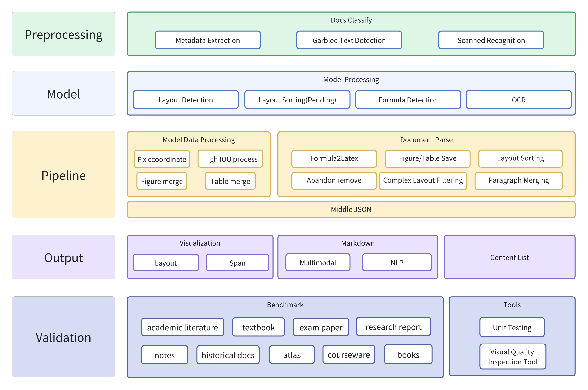

<div id="top">

<p align="center">
  
</p>

</div>
<div align="center">

[](https://github.com/opendatalab/MinerU)
[](https://github.com/opendatalab/MinerU)
[](https://github.com/opendatalab/MinerU/issues)
[](https://github.com/opendatalab/MinerU/issues)
[](https://badge.fury.io/py/magic-pdf)
[](https://pepy.tech/project/magic-pdf)
[](https://pepy.tech/project/magic-pdf)

<a href="https://trendshift.io/repositories/11174" target="_blank"></a>


[English](README.md) | [简体中文](README_zh-CN.md) | [日本語](README_ja-JP.md)

</div>

<div align="center">
<p align="center">
<a href="https://github.com/opendatalab/MinerU">MinerU: PDF-Extract-Kitに基づくエンドツーエンドのPDF解析ツールで、PDFからMarkdownへの変換をサポートします。</a>🚀🚀🚀<br>
<a href="https://github.com/opendatalab/PDF-Extract-Kit">PDF-Extract-Kit: 高品質なPDFコンテンツ抽出のための包括的なツールキット</a>🔥🔥🔥
</p>

<p align="center">
    👋 <a href="https://discord.gg/gPxmVeGC" target="_blank">Discord</a>と<a href="https://cdn.vansin.top/internlm/mineru.jpg" target="_blank">WeChat</a>で参加してください
</p>
</div>

# MinerU 


## 紹介

MinerUは、ワンストップのオープンソースで高品質なデータ抽出ツールであり、以下の主要な機能を含みます：

- [Magic-PDF](#Magic-PDF)  PDFドキュメント抽出  
- [Magic-Doc](#Magic-Doc)  ウェブページと電子書籍の抽出


# Magic-PDF


## 紹介

Magic-PDFは、PDFドキュメントをMarkdown形式に変換するためのツールであり、ローカルに保存されたファイルやS3プロトコルをサポートするオブジェクトストレージ上のファイルを処理することができます。

主な機能は以下の通りです：

- 複数のフロントエンドモデル入力をサポート
- ヘッダー、フッター、脚注、ページ番号の削除
- 人間が読みやすいレイアウトフォーマット
- 見出し、段落、リストなど、元のドキュメントの構造とフォーマットを保持
- 画像や表を抽出してmarkdown内に表示
- 数式をLaTeX形式に変換
- 文字化けしたPDFの自動検出と変換
- CPUおよびGPU環境に対応
- Windows、Linux、macOSプラットフォームに対応


https://github.com/user-attachments/assets/4bea02c9-6d54-4cd6-97ed-dff14340982c


## プロジェクト全景




## フローチャート


### 依存リポジトリ

- [PDF-Extract-Kit : 高品質なPDFコンテンツ抽出のための包括的なツールキット](https://github.com/opendatalab/PDF-Extract-Kit) 🚀🚀🚀

## 入門ガイド

### 要件

- Python >= 3.9

依存関係の競合を避けるために、仮想環境の使用をお勧めします。venvとcondaの両方が適しています。 
例：
```bash
conda create -n MinerU python=3.10
conda activate MinerU
```

### インストールと設定

#### 1. Magic-PDFのインストール

pipを使用してフル機能パッケージをインストールします：
>注意：pipでインストールされたパッケージはCPUのみをサポートし、クイックテストに最適です。
>
>CUDA/MPSによる加速については、[CUDAまたはMPSによる加速](#4-CUDAまたはMPSによる加速)を参照してください。

```bash
pip install magic-pdf[full-cpu]
```
フル機能パッケージはdetectron2に依存しており、コンパイルインストールが必要です。   
自分でコンパイルする必要がある場合は、https://github.com/facebookresearch/detectron2/issues/5114 を参照してください。  
または、私たちの事前コンパイルされたwhlパッケージを直接使用できます（Python 3.10に限定）：

```bash
pip install detectron2 --extra-index-url https://myhloli.github.io/wheels/
```


#### 2. モデルの重みファイルのダウンロード

詳細については、[how_to_download_models](docs/how_to_download_models_en.md)を参照してください。

モデルの重みをダウンロードした後、'models'ディレクトリを大きなディスクスペースのあるディレクトリに移動します。できればSSDに移動してください。


#### 3. 設定ファイルのコピーと設定
リポジトリのルートディレクトリに[magic-pdf.template.json](magic-pdf.template.json)ファイルがあります。
```bash
cp magic-pdf.template.json ~/magic-pdf.json
```
magic-pdf.jsonで、"models-dir"をモデルの重みファイルがあるディレクトリに設定します。

```json
{
  "models-dir": "/tmp/models"
}
```


#### 4. CUDAまたはMPSによる加速
利用可能なNvidia GPUを持っている場合や、Apple Siliconを搭載したMacを使用している場合は、それぞれCUDAまたはMPSによる加速を利用できます。
##### CUDA

CUDAバージョンに応じたPyTorchバージョンをインストールする必要があります。  
この例では、CUDA 11.8バージョンをインストールします。詳細はhttps://pytorch.org/get-started/locally/ を参照してください。  
```bash
pip install --force-reinstall torch==2.3.1 torchvision==0.18.1 --index-url https://download.pytorch.org/whl/cu118
```
また、設定ファイルmagic-pdf.jsonの"device-mode"の値を変更する必要があります。  
```json
{
  "device-mode":"cuda"
}
```

##### MPS

Mシリーズチップデバイスを搭載したmacOSユーザーは、推論加速のためにMPSを使用できます。  
設定ファイルmagic-pdf.jsonの"device-mode"の値を変更する必要があります。  
```json
{
  "device-mode":"mps"
}
```


### 使用方法

#### 1. コマンドラインでの使用

###### シンプル

```bash
magic-pdf pdf-command --pdf "pdf_path" --inside_model true
```
プログラムが終了した後、"/tmp/magic-pdf"ディレクトリに生成されたmarkdownファイルが見つかります。  
markdownディレクトリには対応するxxx_model.jsonファイルがあります。   
ポストプロセッシングパイプラインの二次開発を行う場合は、次のコマンドを使用できます：  
```bash
magic-pdf pdf-command --pdf "pdf_path" --model "model_json_path"
```
この方法では、モデルデータを再実行する必要がなくなり、デバッグが便利になります。


###### 詳細

```bash
magic-pdf --help
```


#### 2. APIを使用した利用

###### ローカル
```python
image_writer = DiskReaderWriter(local_image_dir)
image_dir = str(os.path.basename(local_image_dir))
jso_useful_key = {"_pdf_type": "", "model_list": []}
pipe = UNIPipe(pdf_bytes, jso_useful_key, image_writer)
pipe.pipe_classify()
pipe.pipe_parse()
md_content = pipe.pipe_mk_markdown(image_dir, drop_mode="none")
```

###### オブジェクトストレージ
```python
s3pdf_cli = S3ReaderWriter(pdf_ak, pdf_sk, pdf_endpoint)
image_dir = "s3://img_bucket/"
s3image_cli = S3ReaderWriter(img_ak, img_sk, img_endpoint, parent_path=image_dir)
pdf_bytes = s3pdf_cli.read(s3_pdf_path, mode=s3pdf_cli.MODE_BIN)
jso_useful_key = {"_pdf_type": "", "model_list": []}
pipe = UNIPipe(pdf_bytes, jso_useful_key, s3image_cli)
pipe.pipe_classify()
pipe.pipe_parse()
md_content = pipe.pipe_mk_markdown(image_dir, drop_mode="none")
```

デモは[demo.py](demo/demo.py)を参照してください


# Magic-Doc


## 紹介

Magic-Docは、ウェブページや多形式の電子書籍をmarkdown形式に変換するためのツールです。

主な機能は以下の通りです：

- ウェブページ抽出
  - テキスト、画像、表、数式情報のクロスモーダルな正確な解析。

- 電子書籍ドキュメント抽出
  - epub、mobiなどのさまざまなドキュメント形式をサポートし、テキストと画像に完全対応。

- 言語タイプの識別
  - 176の言語を正確に認識。

https://github.com/opendatalab/MinerU/assets/11393164/a5a650e9-f4c0-463e-acc3-960967f1a1ca


https://github.com/opendatalab/MinerU/assets/11393164/0f4a6fe9-6cca-4113-9fdc-a537749d764d


https://github.com/opendatalab/MinerU/assets/11393164/20438a02-ce6c-4af8-9dde-d722a4e825b2


## プロジェクトリポジトリ

- [Magic-Doc](https://github.com/InternLM/magic-doc)
  優れたウェブページと電子書籍の抽出ツール


# 貢献者の皆様に感謝

<a href="https://github.com/opendatalab/MinerU/graphs/contributors">
  
</a>


# ライセンス情報

[LICENSE.md](LICENSE.md)

このプロジェクトは現在、PyMuPDFを利用して高度な機能を提供していますが、AGPLライセンスに準拠しているため、特定の使用ケースに制限を課す可能性があります。今後のバージョンでは、より寛容なライセンスのPDF処理ライブラリへの移行を検討し、ユーザーフレンドリーさと柔軟性を向上させる予定です。


# 謝辞

- [PaddleOCR](https://github.com/PaddlePaddle/PaddleOCR)
- [PyMuPDF](https://github.com/pymupdf/PyMuPDF)
- [fast-langdetect](https://github.com/LlmKira/fast-langdetect)
- [pdfminer.six](https://github.com/pdfminer/pdfminer.six)


# 引用

```bibtex
@misc{2024mineru,
    title={MinerU: A One-stop, Open-source, High-quality Data Extraction Tool},
    author={MinerU Contributors},
    howpublished = {\url{https://github.com/opendatalab/MinerU}},
    year={2024}
}
```


# スター履歴

<a>
 <picture>
   <source media="(prefers-color-scheme: dark)" srcset="https://api.star-history.com/svg?repos=opendatalab/MinerU&type=Date&theme=dark" />
   <source media="(prefers-color-scheme: light)" srcset="https://api.star-history.com/svg?repos=opendatalab/MinerU&type=Date" />
   
 </picture>
</a>

# リンク
- [LabelU (軽量なマルチモーダルデータアノテーションツール)](https://github.com/opendatalab/labelU)
- [LabelLLM (オープンソースのLLM対話アノテーションプラットフォーム)](https://github.com/opendatalab/LabelLLM)
- [PDF-Extract-Kit (高品質なPDFコンテンツ抽出のための包括的なツールキット)](https://github.com/opendatalab/PDF-Extract-Kit)
